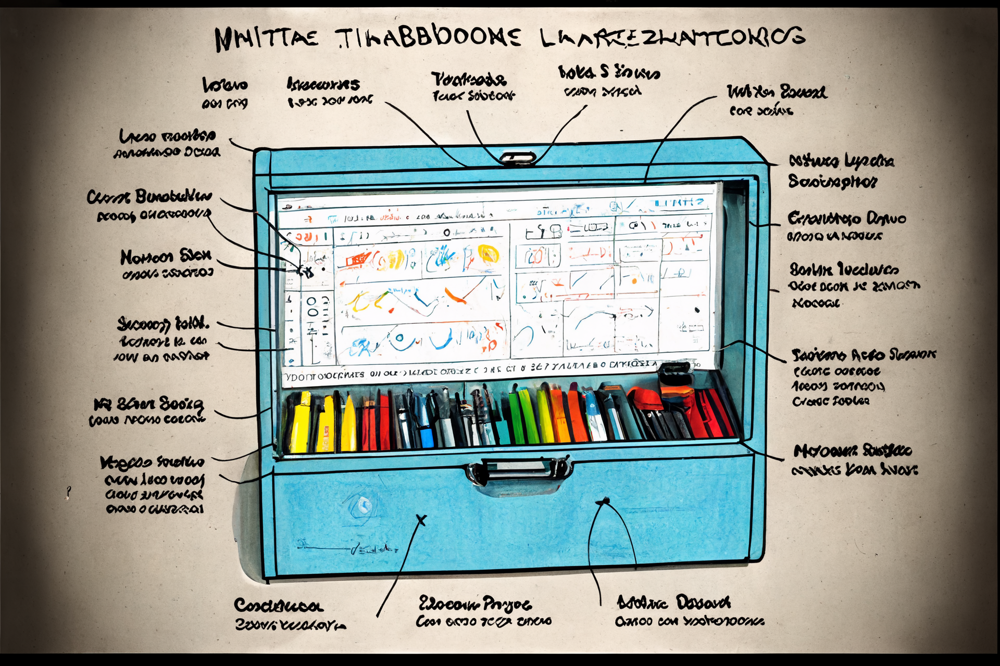

# 🛠️ Collboard administration toolset

Micaceous set of modules to control [Collboard.com](https://collboard.com/) frontend app created via [@collboard/modules-sdk](https://www.npmjs.com/package/@collboard/modules-sdk).

<!--Wallpaper-->
<!--⚠️WARNING: This section was generated by https://github.com/hejny/batch-project-editor/blob/main/src//workflows/315-ai-generated-wallpaper/4-aiGeneratedWallpaperUseInReadme.ts so every manual change will be overwritten.-->

<!--/Wallpaper-->

<!--Badges-->
<!--⚠️WARNING: This section was generated by https://github.com/hejny/batch-project-editor/blob/main/src/workflows/800-badges/badges.ts so every manual change will be overwritten.-->

<!--/Badges-->

